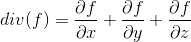
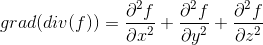
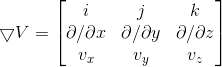

### 散度和旋度

1. 散度是一个标量，表示一个点的邻域附近，矢量场的"出度"。如果一个点附近的散度不是0，那么该点是汇聚点(散度<0)或者是溢出点(散度>0)。由于矢量可以分解为各个分量上，做导数，因此出度等于各个方向导数的和。

2. 拉普拉斯算子，是求梯度的散度，换句话说，是梯度矢量，在各个分量上的导数的和。当我们把梯度看成一个场(例如电场的电势梯度构成一个场)的时候，拉普拉斯算子就是该场的散度。

3. 旋度也是一个矢量。用格林定理或者斯托克斯定理，对于各个方向偏导数之差为0的函数，旋度场为0。就好比在重力场中做功，沿着封闭曲线变化一周，总功=0。

