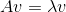
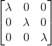
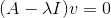
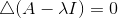
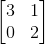
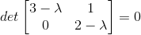
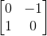

### 矩阵的特征值和特征向量

当我们把矩阵看作是线性变换的时候，如何描述这个线性变换? 我们之前说过，det(A)描述的是一个线性变换把单位网格平面，每个网格拉伸了几倍面积。如果det是负数，说明平面发生了翻转，因此det的符号是有意义的。我们知道描述一个2维平面的特征，除了幅度，还需要方向来表述。那么单位矩阵I作为最基本的线性变换，在被A变换了之后，就变成了A。那么，有没有一些矢量，从A的二维平面上，投影到I的二维平面上的时候，保持不变呢? 如果保持不变，从抽象代数的角度看，就是这个线性变换A的乘法幺元，是用来描述这个乘法运算的最好方式。

代表lambda。我们把lambda看成是一个对角矩阵:

移项，我们得到

也就是这个矩阵把v投影到0，这里的必要条件是行列式=0:

回来再看式子Av=lv，这几个v是A的乘法幺元，说明可以用来构建A本身。v是A的基底矢量，而对应的l是每个矢量方向上det放大的倍数。现在，幅度和方向都有了。对A进行basis change，就用{v}来表示A的线性变换就OK了。v的维度比A可能小很多，有利于运算和分析。{v}是A的本质。

OK，下面这个矩阵的特征值和特征向量怎么求:

按照定义列出式子就可以了:

有两个解，3和2，例如lambda=2的时候，它的特征向量就是[-1,1]。如何求特征向量呢? 带入lambda的解到原来的方程中，求出基础解系就是了。

当然，不是所有转换都有特征向量的。例如下面这个代表左旋90度的矩阵，就没有特征向量。

因为其特征值的解不是实数。

注意，对角矩阵，所有的向量都是特征向量，因为映射不变。