### 矩阵的特征值和特征向量

#### 1. 计算方式
当我们把矩阵看作是线性变换的时候，如何描述这个线性变换? 我们之前说过，det(A)描述的是一个线性变换把单位网格平面，每个网格拉伸了几倍面积。如果det是负数，说明平面发生了翻转，因此det的符号是有意义的。我们知道描述一个2维平面的特征，除了幅度，还需要方向来表述。那么单位矩阵I作为最基本的线性变换，在被A变换了之后，就变成了A。那么，有没有一些矢量，从A的二维平面上，投影到I的二维平面上的时候，保持不变呢? 如果保持不变，从抽象代数的角度看，就是这个线性变换A的乘法幺元，是用来描述这个乘法运算的最好方式。

 , 如果我们把lambda看成是一个对角矩阵:

移项，我们得到 

也就是这个矩阵把v投影到0，这里的必要条件是行列式=0: 

回来再看式子Av=lv，这几个v是A的乘法幺元，说明可以用来构建A本身。v是A的基底矢量，而对应的l是每个矢量方向上det放大的倍数。现在，幅度和方向都有了。对A进行basis change，就用{v}来表示A的线性变换就OK了。v的维度比A可能小很多，有利于运算和分析。{v}是A的本质。

OK，下面这个矩阵的特征值和特征向量怎么求:

按照定义列出式子就可以了:

有两个解，3和2，例如lambda=2的时候，它的特征向量就是[-1,1]。如何求特征向量呢? 带入lambda的解到原来的方程中，求出基础解系就是了。这里lambda=2的基础解系就是[-1,1]

当然，不是所有转换都有特征向量的。例如下面这个代表左旋90度的矩阵，就没有特征向量。因为其特征值的解不是实数。

 其特征方程 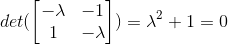。

注意特殊情况: 对角阵，所有的向量都是特征向量，因为映射不变。

#### 2. 几何意义
可以看到  相当于是一个矩阵将向量v映射到了0，说明，这个矩阵所代表的线性映射，是一个降维打击，它把一个二维平面映射到了一条直线L上，而所谓的特征向量，就是被映射到了原点O: 因为特征向量v和直线L垂直。再比如矩阵:
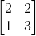，它的一个特征值是1，说明对应的特征向量在线性变换下长度不变。

对于左下角是0的矩阵 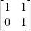, 计算特征值 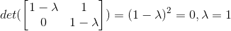, 只有一个特征值。但是一个特征值可以对应多个特征向量。

#### 3. 应用

fibonacci数列的通项公式，就可以用矩阵的特征向量来求解。首先，写出该数列的通项公式: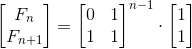，其中: 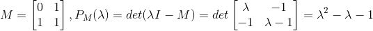，解得特征值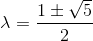

然后，求解特征向量，得到特征矩阵，以及M的特征向量分解形式: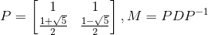
其中D是特征值组成的对角矩阵。

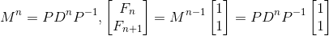 其中 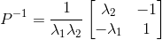

可以解得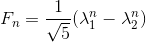

#### 4. 更多的解释
特征向量代表了运动的方向，特征值代表了运动的速率。上面的fib数列，相当于，[0,1]这个启示状态，沿着特征值的绝对值较大的那个特征向量的方向，一直变化(趋近于直线)，无限的放大。特征向量所在的直线上的所有向量都是特征向量。

矩阵的秩R就是特征向量的个数。对于n x n方阵而言，如果R小于n，说明是个降维映射，也就是矩阵的向量线性相关。例如矩阵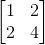，两个向量是线性相关的，它把不在一条直线上面的三个点[1,0],[1,1],[0,1]分别映射成:
[1,2],[3,6],[2,4]这3个点在一条直线上，并且该直线就是特征值5对应的特征向量----矩阵把点映射到特征向量所在的方向了。