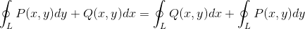
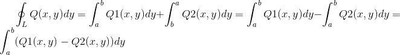
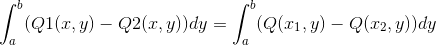
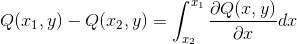
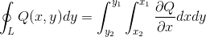
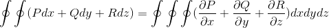

### 格林公式(定理)和高斯公式(定理)

#### 格林公式

 在一个二维平面上做一个对于坐标的曲线积分(封闭凸曲线)，由于这个积分可以化成对于x和对于y的曲线积分的和。

那么首先看y向量的积分的部分，由于这个部分上dx没有意义，因此x看成常数，dx是0，所以P(x,y)dx的积分=0。

  (1)

然后，求对于dy的积分。由于y的函数表示是Q(x,y)，积分Q(x,y)dy，可以写成封闭曲线的上下两个部分积分之差，上面的表达式写成Q1(x,y)，下面的表达式写成Q2(x,y)，dy积分的范围是[a,b]

  (2)

对于固定y的时候，Q1(x,y)-Q2(x,y)是一个关于x的函数，Q1和Q2是同一个函数Q，可以写成Q(x1,y)-Q(x2,y)

 (3)

反向使用牛顿-莱布尼茨公式, 这是个定积分，被积分函数是Q对于x的偏导数。

 (4)

因此(2)可以写成

 (5)

国内的教程通常把积分区域划分成若干个小方块再求和，这样容易理解积分区域，但是这不是证明所必需的。

而斯托克斯(Stokes)定理是格林定理在3维的情况，推导过程类似。

#### 高斯公式

在2/3维上面对封闭曲线(面)对弧长(面积)做积分，得到的是通量(没有方向)，升高一维做积分，被积函数是偏导数的和。

原理也是类似的。