### 用[和函数]理解不定积分和定积分

#### 1. 问题的引入
从油管上看到一个非常好的对于"动态规划"的解释，这个例子却帮助我真正明白了不定积分是怎么回事。

视频的作者是美国人，他的父亲在一个城市的公共部门工作，其中一个工作是调查一条街上的居住人员的数量。例如一条街叫做street，统计工作就是看每100米居住的人数，以及整条街的总人数。

可以这样做统计: 用一个excel表来表示：

<table>
    <tr>
        <th>0-100m</th>
        <th>100-200m</th>
        <th>200-300m</th>
        <th>300-400m</th>
        <th>400-500m</th>
        <th>...</th>
    </tr>
    <tr>
        <th>15人</th>
        <th>8人</th>
        <th>11人</th>
        <th>25人</th>
        <th>19人</th>
        <th>...</th>
    </tr>
</table>

统计完整条街以后，可以计算sum=15+8+11+25+19... 然后记录下来。

这样做当然OK。那么如果要计算从200m-500m之间的人数，就要做一个加法11+25+19。如果要计算200m到2000m之间的人数，就要做一个加法，把很多个数加起来... ...在那个电脑没有普及的时代，这不但很费时，而且很容易出错：即使现在电脑普及了，在excel里面选择n个格子，鼠标拖拽，也不是一件很容易的事情。

那么，如何改善上面这个记录表格的内容或者格式，使得

(1)求总和

(2)求部分和

这两个任务变得高效而且不容易出错?

几十年前的美国劳动人民想出了一个非常科学的办法: 就是总是记录部分和。也就是，做记录的时候，不再写当前范围的人口，而是记录到目前为止全部统计到的人数

<table>
    <tr>
        <th>调查范围</th>
        <th>0-100m</th>
        <th>100-200m</th>
        <th>200-300m</th>
        <th>300-400m</th>
        <th>400-500m</th>
        <th>...</th>
    </tr>
    <tr>
        <th>调查结果</th>
        <th>15人</th>
        <th>8人</th>
        <th>11人</th>
        <th>25人</th>
        <th>19人</th>
        <th>...</th>
    </tr>
    <tr>
        <th>调查记录</th>
        <th>15人</th>
        <th>23(=15+8)人</th>
        <th>34(=23+11)人</th>
        <th>59(=34+25)人</th>
        <th>78人(=59+19)</th>
        <th>...</th>
    </tr>
</table>

这样一来，在统计记录结束的时候，最后一个格子记录的就是前面全部的总和，记录的格子还省掉了一个。更关键的是，计算200m到500m之间有多少人，直接用78-23=55人就得到答案，不必再次计算一堆数的和。

#### 2. 计算方法
上面这个思想就是[不定积分+定积分]的思想。劳动人民早已发现，只是数学家提出概念。关键点是:

假设这条街就是定义域x(离散点)，每个范围的人数是一个f(x)，那么我们记录的就是

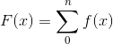

那么一个区间的范围，人数的表示就是:

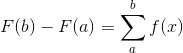

把这个离散形式转换成连续形式，区间变成dx，趋近无穷小，那么和函数(部分和)的表示形式:

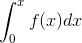

这就是我们知道的不定积分形式。那么不定积分的导数，就是原函数f(x)，也就是F(x)。
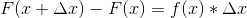
，两边同除以，就是导数关系了。

F(x)在一个区间上，左右两个值的差，除以区间的长度。用概率的角度来看，就是f(x)就是F(x)在x上的密度函数。但是上面这个公式常常让人费解，因为x是一个变量，对于某个和函数而言，求和上限应该是固定的，要把x看成是一个常量来处理。因此更好的写法是下面这样的:

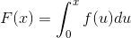

在求二元积分的时候，这样的表示形式尤其清晰。注意，不定积分是一个[函数]，定积分是一个一维标量(scalar)。

#### 3. 数学含义

由于不定积分，其实就是导数(derivative)的反函数，因此研究不定积分就要研究微分计算的几个基本规则: 加法律(additive rule)，幂次律(power rule)，乘积(produce rule)，商律(quotient rule)，合成律(chain rule)。

例如求ln(x)的导数: 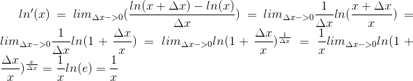

再比如，有些导数是隐含的，比如单位圆的方程: 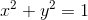，求y点的导数需要用到chainRule: 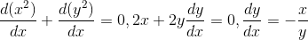，化成极坐标，x=sin(t) y=cos(t) 那么这个导数/斜率就是-tan(t)。

#### 4. 多于一维的情况
组合律的应用，遵从线性映射的组合律，也就是点积运算求得。例如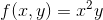，求这个函数在单位圆上面的导数，由于可以写成t的函数x(t)=cos(t),y(t)=sin(t)，当我们直接求f't的时候，可以得到: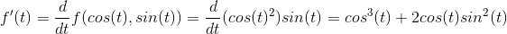。如果我们分步来求，可以得到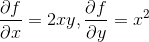，同时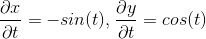，比较上面3个式子，可以验证合成律的一般形式: 

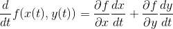----(1)

对于这个式子，可以理解为类似1维的情况，但是需要写成向量的形式。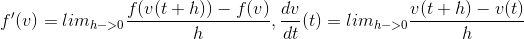，我们又知道: 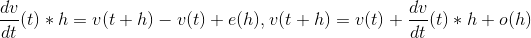，因此:

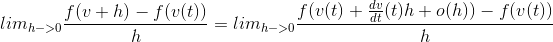

上式就是f在v方向上的方向导数的定义。而方向导数其实是线性代数里面用点乘的方式得到的一个映射。这也就是解释了(1)式的代数意义。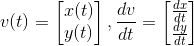，因此(1)式可以写成点乘形式:

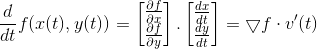，这个看起来就和单个变量的合成律很像了。