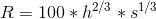
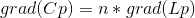
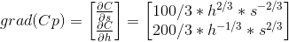
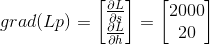
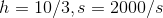
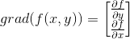
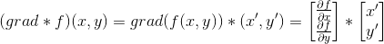

### 有约束条件的优化问题: 从梯度到拉格朗日乘数法

拉格朗日乘数法(Lagrange mutiplier)是基于这样的一个场景: 求一个n元函数的最大值，给出n-1个约束条件。如果n=2, 就是求f(x,y)的最大值，约束条件是g(x,y)=0。

一个最简单的例子来自可汗学院(Khan Academy) 视频地址 https://www.youtube.com/watch?v=BSKtQcLQLWU 

#### 例子摘录如下:

有一个钢铁厂，每个工人工时的成本20元，总共使用h个工时； 钢铁原料s每吨2,000元。现在有20,000元的预算投入生产，问如何使得总的产出R(Revenue)最大:

约束条件是

求解的思想:

#### 1. 约束条件
所谓小于等于20000元，我们显然知道是等于20000元时，可；以得到最大的产出。如果画出s-h的坐标系，约束条件就是20h+2000s=20000，这是一条负斜率的直线L。接下来就是最精髓的部分:

假设R取固定值k(满足条件R=k)，那么R就是s-h平面上面的一条曲线，画出来类似log曲线。对于不同的k，这些曲线形成一个曲线族，我称为Curves。如果在Curves里面有一条曲线C，它和L有且只有一个交点p，那么这个交点就是我们要求的最优解。

为什么? 如果有多个交点，说面曲线C可以继续向右上方移动，R可以取更大的k。如果没有交点，说明k是一个无法达到的值。因此如果有最优解，那么一定有且只有一个交点。这个思路其实是把约束条件看成是常量，待求曲线看成新的约束条件。

#### 2. 求解
OK, 现在我们知道L和C相交于p，那么p有什么特点？因为L是直线，和C相交于一点，立刻知道L是C的切线，p点处，C的法线方向就是L的垂线方向。用微积分的话说，在p点，C的梯度平行于L的梯度: 这个正比例关系用下面的式子表示:

这里n是一个比例系数，书中常用希腊字母lambda表示，为了输入方便我就用英文字母n了。grad代表求梯度的函数。那么我们知道梯度是一个矢量:

对上面三个式子联立，可以消除n，然后得到h和s之间的关系: h=200s，再代入到约束条件里面我们得到:

------------------

一般的高等数学里面，通常是先介绍方向导数，再介绍梯度。按照可汗学院的说法，先介绍梯度是个更好的选择。因为我们需要从矢量的角度来理解，为什么方向导数最大值的方向，就是梯度方向。同样用可汗学院的说法:

首先，假设2维平面的梯度矢量可以写成:

为了抽象, 把这个函数嵌套写成抽象代数里面的乘法运算(群)，grad和f都作为函数group的一份子，那么某一个点(x,y)的方向导数，就可以写成grad*f和(x,y)这个矢量的点乘，还是用乘法符号*来表示:

上式中的(x',y')是和(x,y)平行的单位矢量。要使得这个结果(标量)最大，那么显然要让(x,y)的方向就等于梯度的方向----换句话说，一个点(x,y)的所有方向导数中，梯度方向取得最大值。