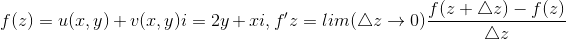
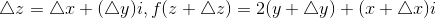
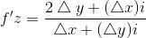

### 复数和留数

看一个函数是否连续可导的时候，复数函数和一维的普通函数不同: f(x)在x=a点的导数，是左导数和右导数相等就可以了。如果左右导数不相等，那么在x=a点倒数不存在，是一个跳变点。换句话说也就是从定义域x轴的两端逼近的斜率相等就是连续可导的。但是由于C域是一个平面，需要从各个方向逼近z=a这个点。例如

在z=a点附近，这个导数的值总是等于3a^2，因此认为连续可导(正则)。另外一个例子是

其中

因此导数:

当我们沿着x轴求这个导数(极限)，f'z=i，沿着y轴求得到f'z=-2i。所以f不是正则函数。

#### 洛朗级数

复数函数在z点附近展开成洛朗级数以后，由于z->a，因此a0-an项全都归零。

#### 留数

做洛朗级数展开后，式子两边的围线积分，可以知道principal部分的围线积分也是0，因此留数和原函数的围线积分成正比例关系。这让我们知道留数可以用来计算一些超越积分。

#### 应用

例如无穷积分，可以用留数来解决。在函数的pole点附近做圆周，那么R(无穷圆周)-r(小圆)+x轴共同构成一个积分区域，积分为0. 无穷远点的积分可以用留数来求，小圆的积分可以用留数来求，剩下的部分就是在x轴上除掉pole点的超越积分。因此这个积分其实就是小圆的留数减去无穷远点的留数。