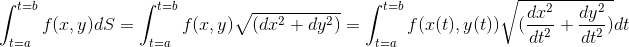
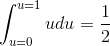

### 曲线积分(linear integral)

#### 计算曲线下的面积(对弧长的曲线积分)
对于一维的情况f(x)下面的面积就是x定义域上的定积分，有一个积分的范围。对于2维的情况，我们想要计算(x,y)平面上f(x,y)在某个定义曲线对应的曲面的面积。这个就是对弧长的曲线积分。

这个曲面实际上是垂直于(x,y)平面的一个竖着的墙，可以理解为平面上，定积分的平面区域被放到了3维空间，求一个曲面的面积。这个曲面的上边沿就是f(x,y)，下边沿就是(x,y)平面。

假设x,y都是t的函数,x=g(t),y=h(t)，然后对于弧长的积分可以写成 

举个具体的例子，f(x,y)=xy, 积分曲线C是x=cost, y=sint, t=[0, PI/2]，是在第一象限的一个半圆。
，再设u=sin(t)，原式=