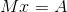
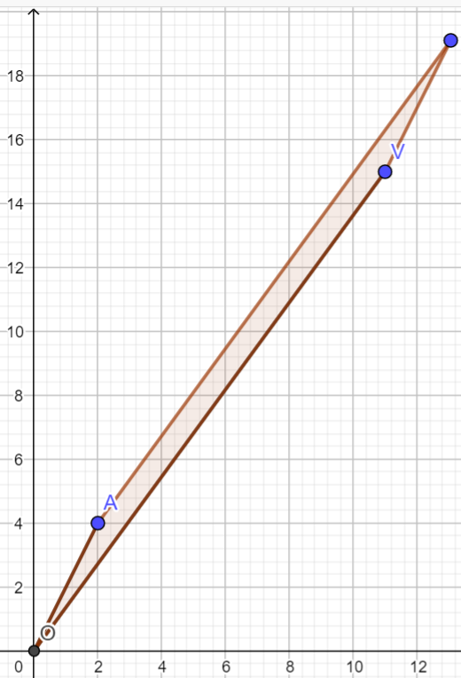
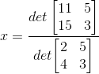
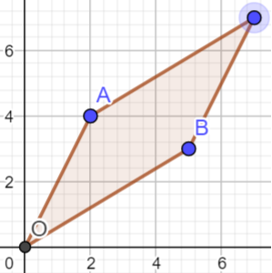
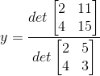

### 克拉默法则

求解线性方程组的定解(如果存在)，有两种方法，算数方法是高斯消元法，把矩阵的左下角变成0，对角线变成1。这个方法是OK的，但是却不能一个能被完整表述的代数方法。那么克莱默法则(Cramer's rule)解线性方程组的解，是行列数的商，这个在几何或者数学上到底有什么含义?

理解这个含义，需要用到向量基础变换的概念(basis change)。

最简单的一个例子，在一个二维平面(x,y)上面，我们把所有的点和一个矢量联系起来，那么可以用(0,1)(1,0)这一组(2个)矢量作为基底，足够表示整个矢量空间。那么也勀用别的矢量来作为基底，只要这两个矢量没有平行就可以了。那么这个基底的叉乘(也就是2维平面上一个平行四边形的面积)是一个重要的概念，表示了用这组矢量去代表其他矢量的时候，需要初除以的一个基数。例如当我用(1,0)(0,1)表示(6,8)时，如果基准向量变成(0,2)(2,0)那么被表示的向量就是(3,4)。

其次，要理解行列式det的含义。对于单位向量基而言，(0,1)(1,0)张成一个1x1的正方形面积是1，如果基准取(0,1)(-2,3)，那么由于det=3，认为新的向量基是这样的一个映射: 它把每个单位网格的面积拉伸到原来的3倍。如果是变成(1,0)(-1,0)，那么相当于整个往左旋转90度，但是det=1，说明没有任何拉伸。

那么一个最简单的线程方程组代表什么? 矩阵看作一个线程变化的时候，就是一个线性变换，和某个矢量的投影下(因为是点乘)，变成了另外一个矢量。

最简单的是2维的情况。例如

x代表，M作为一个基底的时候，它表示的(x,y)，对应于单位基底(矩阵I)的表示的(11, 15)。然后要这样看问题: 

(a) 易知在原二维向量平面上，矢量v=[x,y]，和x轴的单位向量组成一个平行四边形，这个四边形的面积(Area)就是y

(b) v和y轴的单位向量组成一个平行四边形，这个平行四边形的面积(Area)就是x

(c) 然后用M来代替I(使得v经过线性变换变成了新的目标矢量V=[11,15])，此时原来平面上的平行四边形的面积，现在也都相应增加到了det(M)倍。

于是在新的矢量平面上:

(1) 基矢量A=[2,4]和V张成的平行四边形的面积AreaY=det(M)*y

(2) 基矢量B=[5,3]和V张成的平行四边形的面积AreaX=det(M)*x

再次解释:这个式子是M经过投影变换(x,y)变成了矢量(11,15)，那么投影的x部分就原来的向量在投影后的模的伸长倍数。这个伸长的倍数可以用面积的商来表示:

=(-42)/(-14)=3

上面的det是基向量映射后的平行四边形的面积。下面的det是原来的基向量的平行四边形的面积。

y的公式类似

=(-14)/(-14)=1

这就是克莫尔法则解释的线性变换本身的几何内涵: M矩阵将(3,1)映射到(11,15)。