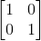
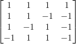
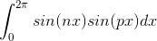
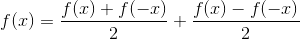
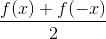
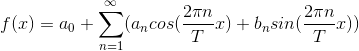
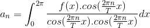
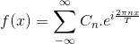
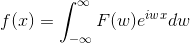
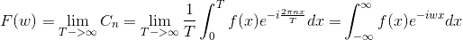

### 从正交变换到傅立叶变换

许多工科同学都学过傅立叶变换，但是这个变换在数学上的意涵，仍然需要细究。

首先要引入的一个概念是正交基。这是一个线性代数/高等代数的概念，意涵是n维空间上，有一组向量，两两互相正交: 两个向量的点乘=0，或者说，任意一个向量在其他向量上面的投影为0。那么这个n维空间上面任何一个向量都可以用这个正交基各个向量上的投影来表示。

#### 1. 有限个离散向量组成的正交基:
例如2x2的矩阵(行列式!=0)都可以用下面的对角矩阵进行分解:

那么向量(1,0),(0,1)就组成一个最简单的正交基。这个是线性代数的基本知识。扩展一下，n x n的对角矩阵，其实对应n个向量组成的n维正交基，可以用来分解一个n维的普通向量。

下面这样的一组向量也组成正交基:

可以看到这组向量，两两点积都是0。当然，还可以进一步单位化，也就是前面都乘以1/2，就完美了。任何一个4维向量，都可以用这个正交基的线性组合表示。

为什么要用线性组合? 因为人只能理解求和，部分和，线性关系。因此，分解的实质是把目标函数拆解成一个多项式。泰勒级数是一种多项式逼近，但是泰勒级数不是正交基分解。对角矩阵是正交基分解，但是有限制:

1. 矩阵是n维的，需要被拆解的对象也是离散形式的多项式。
2. 离散形式的各个正交基重要程度相似，难以近似和逐渐逼近。

因此，我们既要像泰勒级数那样能逐渐逼近(方便计算和舍弃)，又希望这个级数展开形式各个项之间正交，那么就找到三角函数族作为正交基。当然，作范围是周期函数。

#### 2. 周期函数的三角函数展开
可以知道sin(nx)这个函数族，在[0-2Pi]范围内，都是两两正交的。cos(nx)也一样。

 

其中n,p都是自然数

对于连续函数而言，正交就是两个函数乘积在区间里面的积分: 积分就是乘积的部分和，没有问题。因此，有了傅立叶级数。那么第一个问题: 为什么既要有cos又要有sin?

因为一个函数本身，可以分解成奇函数和偶函数的和。为什么?

其中前面的部分

是偶函数要用cos展开，后面的部分是奇函数要用sin展开，容易验证。

其中的cos和sin都是基，那么an和bn都是f(x)在cos/sin上的投影，于是:

bn类似。如果用欧拉公式来重写成复数形式，那么会更简单。

但是傅立叶级数本身有限制: sin(nwx)要是正交基，那么函数f(x)本身必须是周期函数。那么f(x)如果不是周期函数? 可以想象这是一个周期无限大的周期函数，只是我们关心其中的一段，那么傅立叶级数中的w(角速度)变得非常小，这样一来，就相当于正交基变得互相靠在一起，从一组以自然数为下标的，无穷多个的正交基，变成一组以实数为下标的，无穷多个的正交基。

为了表示方便，我们把傅立叶级数映射到C平面(x/y平面的傅立叶级数和C平面的傅立叶级数表示，是双射关系，所以替代性的表示利于研究)。

周期T推向无穷的时候可以得到，傅立叶级数的离散求和关系变成了C域沿着单位圆的环路积分，级数展开变成了积分变换，于是我们得到了傅立叶变换。

#### 3. 傅立叶变换

其中F(w)是Cn在T->无穷时的极限:

注意，我们假设用于傅立叶变换的f(x)是周期无穷大的，因此F域的表示是一个正交基exp(jw)的密度函数的概念。如果f(x)本身含有周期信号的部分，那么这个密度在周期上就是无穷大，看F(w)的图形上就是一个冲击。

注意，我们不是从几何的角度理解傅立叶级数和傅立叶变换，而是从线性代数的角度来理解。

#### 4. 离散傅立叶变换
因为数字信号总是要抽样的，因此不存在t定义域连续的函数。那么，抽样函数因为本身是周期的冲击信号，等于会把频率做一个周期延拓，也就是原来的最高频率F的两倍，是延拓后频率F不重叠的底线。那么上面的积分公式，再次变成了一个求和公式。区别是什么呢？傅立叶级数，是周期的无穷长度信号求和，而离散傅立叶变换是有限长度非周期的信号，用复数变换基进行抽样后的加和结果。由于复数的对称性，只需要计算一般的频率谱，并将结果乘以2.

