### 复数和留数

看一个函数是否连续可导的时候，复数函数和一维的普通函数不同: f(x)在x=a点的导数，是左导数和右导数相等就可以了。如果左右导数不相等，那么在x=a点倒数不存在，是一个跳变点。换句话说也就是从定义域x轴的两端逼近的斜率相等就是连续可导的。但是由于C域是一个平面，需要从各个方向逼近z=a这个点。例如

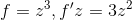

在z=a点附近，这个导数的值总是等于3a^2，因此认为连续可导(正则)。另外一个例子是

其中

因此导数:

当我们沿着x轴求这个导数(极限)，f'z=i，沿着y轴求得到f'z=-2i。所以f不是正则函数。

要一个复函数正则，需要满足柯西-黎曼公式。并且可以得出，u和v的拉普拉斯算子结果一定是0.

#### 洛朗级数

泰勒级数是在某个点附近展开的关于x的多项式----函数f(x)需要在x附近的邻域内可导，而洛朗级数则是复函数在z=a点附近的展开多项式，a点附近的邻域则表示为一个环(二维的情况)并且这个环，外圈的半径可以是无穷大。那么这个展开式有两个部分，前面一个部分和实数函数的泰勒级数展开相似，是个多项式，后面一个部分是有理式的表示。多项式的部分也叫analytic part，有理式的部分也叫作pricipal part.

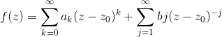

复数函数在z点附近展开成洛朗级数以后，由于z->z0，因此a1-an项全都归零, b1项要除以0，因此f(z)的洛朗级数在z=z0是没有定义的。由于洛朗级数是在z0周围展开的，不要求被展开的函数要处处连续。

那么a0,a1,...b1,b2......这些系数是怎么求来的? 泰勒级数是用各阶导数来求解的，而洛朗级数的各个系数，是用环路积分来求解的。

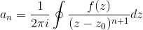

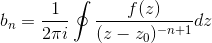

a) 如果bi都是0，那么称f(z)解析，也就是没有极点(pole)。

b)否则，z0是一个奇异点。

c) 
i)如果bn!=0，而b(n+1)等后面的点都是0，则我们说z0是n阶极点。如果n=1，称为简单极点。

ii) bn都是0时，an!=0且a0-a(n-1)都是0，则称z0是f的n阶0点。

d) 1/(z-z0)的系数b1称为f在z0点的留数。

#### 留数

做洛朗级数展开后，式子两边的围线积分，可以知道principal部分的围线积分也是0，因此留数和原函数的围线积分成正比例关系。这让我们知道留数可以用来计算一些超越积分。

简单的例子，复函数f(z)=sin(z)/z^2，用sin的泰勒级数形式展开我们得到:

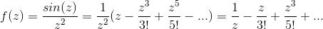

因此z0=0是一个简单极点。b1=1(留数)

更复杂一点的例子是多个值的极点，对应于不同的阶数。

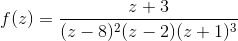

这个f(z)有3个极值点，z=8是2阶点，z=2是1阶，z=-1是3阶。

从环路积分的定义来看，一个闭合环路c上面的f(z)的积分，等于环绕各个极点的积分的和(因为f(z)环绕无极点的积分是0)。

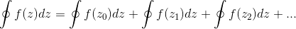

而对于每一个极点z0/z1/z2...的环路积分而言，可以用洛朗级数展开为下面的形式:

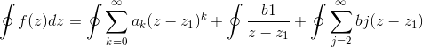 (1)

由于analytic部分，环路积分为0(柯西积分定理)。上式简化为:

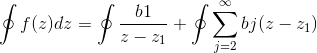

对于上式的第二部分，我们令

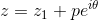
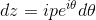

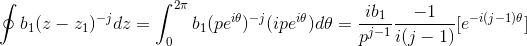

用欧拉公式来求上面[0-2 PI]的积分值=0. 因此(1)式只剩下了一项，那就是环路积分等于留数的和乘以2 PI i。这就是留数这个名字的由来。

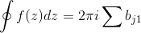 (2)

#### 应用

例如无穷积分，可以用留数来解决。在函数的pole点附近做圆周，那么R(无穷圆周)-r(小圆)+x轴共同构成一个积分区域，积分为0. 无穷远点的积分可以用留数来求，小圆的积分可以用留数来求，剩下的部分就是在x轴上除掉pole点的超越积分。因此这个积分其实就是小圆的留数减去无穷远点的留数。

i) 使用积分的柯西pricipal value，也就是说

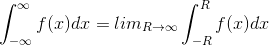

ii) 如果f(x)是偶函数，且柯西pv存在，那么无穷积分就等于柯西pv。

下面就可以计算无穷积分。当然f(x)=p(x)/q(x)这样形式的函数，无穷积分要能用留数来求需要几个条件:

a) f(x)是有理函数(如上所述)

b)p和q的系数都是实数，且不能约分

c)q的次数至少比p多2

d)q(z)没有实数0点，但是在实数轴上方有至少一个零点。

下面是求解的步骤:

s1) 找到q(z)在实数轴上面的所有0点。从上面得到的环路积分/留数和之间的关系公式(2)。由于现在的环路积分分成两个部分，一个是从实数轴[-R,R]，一个是环路(圆形Cr)，两个加和。因此:

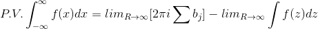 (3)

在(3)中，关于R的半圆积分，可以用极坐标求解

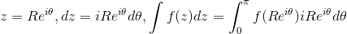

下面举例。计算

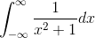
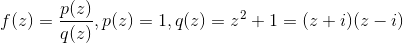

因此P.V.积分=

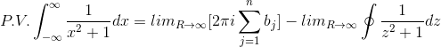

其中第二项可以用圆形积分来计算，等于0. 由于上半平面的零点只有一个z=i(如图的A点)，

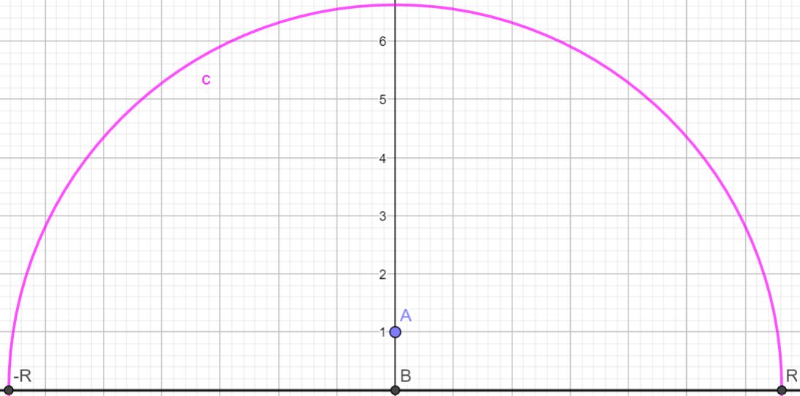

所以bj的计算公式:
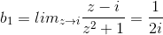
所以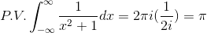

再举一个例子:

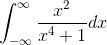

同样用上半圆法则来计算:
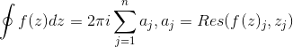，

需要考虑的极点(上半平面)是: 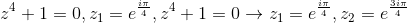

同时，留数定理的约束条件里面说了，如果f(z)是一个有理多项式的形式: 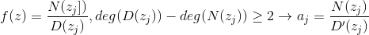，

1. R趋近无穷的时候，容易得到圆周积分=0
2. 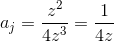

因此留数=
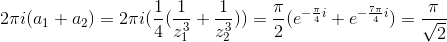

还有一类不好计算的有限积分，被积函数里面有很多三角函数的形式。这个通过极坐标方法化简为z的积分问题，然后再使用留数的方式求解。

----------------
所有这些的起点，都是两个思想:

1. 柯西积分公式，描述了f(z0)和f(z)/z-z0环路积分之间的关系。环路积分等于围绕z0点的积分，因此也就是f(z0)/z-z0的环路积分，常数提取出去以后，剩下就是z-z0围绕z0的环路积分。
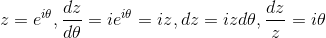
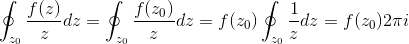

用极坐标计算=2 PI i。如果环路积分相当于抽象代数里面的乘法，那么柯西积分公式就是这个乘法运算的幺元。

2. 洛朗级数推导出的留数定理，描述了f(z)的环路积分和f(z)(z-z0)的环路积分(系数bj)之间的关系。这个关系相当于是帮助我们能在无法计算积分的时候(分母有0点，对应多项式的根)，用乘以(z-z0)的方式去消掉分母中的0项，使得积分可以计算。

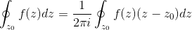

试想，多项式的分母如果可以在实数范围因数分解，那么就可以拆成一次多项式，求积分就是ln。但如果不能实数分解，在上半圆复数根互相不能重叠，因此只要能消去分母中的根因子，计算就能得以进行。这就是使用留数定理的场景。