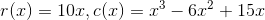
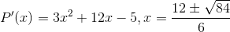
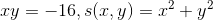
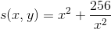

### 用导数求解极值问题

收益函数r和支出函数c分别是,p(x)=r(x)-c(x)，其中，求解得到，当然求得两个x是极值点，但是我们不知道是极大还是极小，因此求二阶导数，P''(x)=-6x+12，代入上面的两个x，二阶导数<0才是极大值点。x约等于3.528

还有一类例子，是求解最大值和最小值，P(x)函数的形式未知。例如两个数的乘积是-16，求两个数的平方的和的最小值。

两个式子合并可以得到求s的最小值。这个就很容易了，令s'(x)=0，求出[x,y]=[4,-4]或者[-4,4]。s最小值就是32.(因为s''(x)是个正数，因此是极小值)